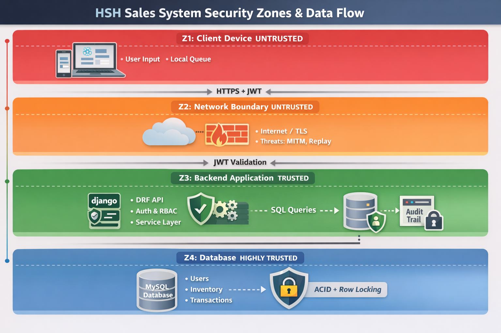

# 🔐 HSH SALES SYSTEM — SECURITY ARCHITECTURE (v1.1)

**Author:** Sean Wong | **Date:** 2026-01-14

**Purpose:** Define how the HSH Sales System enforces **security by design**, protecting data integrity, user roles, and offline operations.

---

## 1️⃣ Security Principles

1. **Zero Trust at Boundaries** – Do not trust any client or network by default.
2. **Backend as Source of Truth** – All critical state (pricing, inventory, transactions) validated server-side.
3. **Explicit Trust Elevation** – Authenticated, authorized, and validated requests only.
4. **Side-Effect Isolation** – Printing, offline storage, and UI state cannot mutate authoritative data.
5. **Auditability by Default** – Every critical action is logged and immutable.

---



## 2️⃣ Trust Zones

| Zone | Name             | Trust Level    | Key Elements                      |
| ---- | ---------------- | -------------- | --------------------------------- |
| Z1   | Client Device    | Untrusted      | Browser, LocalStorage, JS runtime |
| Z2   | Network Boundary | Untrusted      | Internet, HTTPS, TLS              |
| Z3   | Backend App      | Trusted        | DRF APIs, Service Layer           |
| Z4   | Data Store       | Highly Trusted | MySQL DB with ACID enforcement    |

**Key Concept:** Each zone has explicit trust assumptions and clear enforcement points.

---

## 3️⃣ Authentication

* **Mechanism:** JWT via DRF SimpleJWT (access + refresh tokens)
* **Flow:**

```
Login → Credentials validated → JWT issued (role embedded) → Token stored in memory → API requests
```

* **Mitigations:** Short-lived tokens, signature verification, rate limiting, audit logs.

---

## 4️⃣ Authorization (RBAC)

| Role       | Permissions                                 |
| ---------- | ------------------------------------------- |
| Admin      | Full system access                          |
| Sales      | Transactions, delivery, read-only inventory |
| Supervisor | Reporting, delivery oversight               |

* Enforcement occurs at **view layer** and **service layer** (defense-in-depth).
* **No client-side authorization** is trusted.

---

## 5️⃣ Attack Surface Analysis

**Client-Side (Z1)**

| Vector              | Risk             | Mitigation             |
| ------------------- | ---------------- | ---------------------- |
| LocalStorage tamper | Data poisoning   | Server-side validation |
| JS manipulation     | Forged payloads  | Backend recalculation  |
| Offline replay      | Duplicate writes | Idempotent endpoints   |

**API / Backend (Z2/Z3)**

| Vector               | Risk                   | Mitigation                  |
| -------------------- | ---------------------- | --------------------------- |
| Replay attacks       | Duplicate transactions | Idempotency keys            |
| Injection            | Data corruption        | ORM + serializer validation |
| Privilege escalation | Unauthorized access    | RBAC enforcement            |

---

## 6️⃣ Offline Security Model

* Offline data is **never trusted**
* Stored locally in **queue**, replayed when online
* Backend **re-validates**: JWT, permissions, inventory, pricing

```
Offline Payload → Replayed on reconnect → Backend validation → Accepted/Rejected
```

---

## 7️⃣ Transaction & Inventory Integrity

* Updates occur **only** in backend service layer
* Wrapped in **atomic DB transactions**
* **Optimistic / row-level locking** prevents double deductions
* Prevents race conditions and client-forced stock changes

---

## 8️⃣ Audit & Non-Repudiation

* **Events Logged:** Login/logout, transaction creation, batch distribution, inventory changes, admin actions
* **Guarantees:** Append-only, server-side timestamps, read-only admin access, no deletion endpoints

---

## 9️⃣ Deployment Security

* Backend + DB on private Docker network
* Frontend served over **HTTPS only**
* Secrets in **environment variables**
* Database **not publicly exposed**

---

## 🔟 Security Non-Negotiables

* UI cannot write system truth
* All writes go through **authenticated, authorized APIs**
* Inventory changes are **atomic**
* Printing cannot block persistence
* Audit logs are immutable

---

## 1️⃣1️⃣ Security Posture Summary

* **Structural trust boundaries** minimize attack surface
* Backend is **authoritative source**
* Offline operations are **securely validated**
* Compliance-ready logging and audit capabilities
* Security is **enforced by design**, not by convention

---


